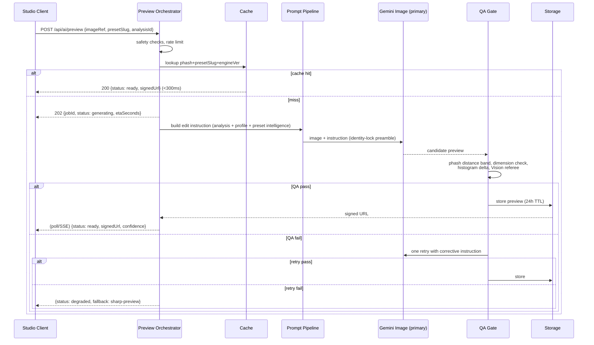

# PXL Creator — AI Preview Engine

**Master Engineering Blueprint (Phase 4) — Architecture Only, No Implementation**

| | |
|---|---|
| Status | Approved for implementation planning |
| Version | 1.0 — July 2026 |
| Depends on | Phase 1 (AI architecture), Phase 2 (Gemini Vision), Phase 3 (Preset Intelligence Engine) |
| Owner | AI Platform |
| Implementer | To be handed to implementation agent — this document is the source of truth |

---

## 0. Executive Summary

Users upload a photo, the existing pipeline analyses it and recommends presets. Phase 4 adds a **realistic AI-generated preview** of the recommended preset's look applied to *their* photo — before they buy.

**Three decisions define this design:**

1. **Provider: Gemini 3.1 Flash Image ("Nano Banana 2") primary, FLUX.1 Kontext Pro fallback.**
   Same vendor/SDK/key as our Phase 2 vision stack, ~$0.04/image, editing-native with
   strong identity preservation, and the fastest inference in its class. FLUX Kontext Pro
   is contractually and technically the closest substitute at the same price, wired in
   through the same provider abstraction we already proved with `AIProvider`.

2. **Hybrid preview, not generative-only.** The studio *already* renders a deterministic
   Sharp preview (real pixel math) in ~2s. That stays as the instant baseline. The
   generative preview arrives asynchronously (~8–15s) as an **enhanced preview** and
   replaces the baseline only after passing automated QA. The user is never blocked
   waiting for a diffusion model, and a provider outage degrades to exactly what ships today.

3. **Truth-in-preview is a product constraint, not an afterthought.** A generative preview
   *approximates* the preset's look; it is not the preset's literal output. Previews are
   labelled "AI-visualized preview", QA-gated for fidelity, and the roadmap includes the
   Adobe Lightroom API (Firefly Services) as the future *exact* renderer once volume
   justifies its enterprise minimum.

Cost at scale: **~$0.05/preview all-in** → $50/mo at 1k, ~$390/mo at 10k, ~$3.1k/mo at
100k with caching. p50 latency ~9s, p95 ~15s against a 20s hard ceiling.

---

## 1. Provider Comparison (researched July 2026)

### 1.1 Candidates

| Criterion | **Gemini 3.1 Flash Image**<br>(Nano Banana 2, Google) | **Nano Banana Pro**<br>(gemini-3-pro-image) | **FLUX.1 Kontext Pro**<br>(Black Forest Labs) | **GPT Image 2**<br>(OpenAI) | **Adobe Firefly Services**<br>(+ Lightroom API) |
|---|---|---|---|---|---|
| Editing quality | Very good — editing-native, "preserves everything you didn't ask to touch" | Best-in-class; 4K output | Very good; purpose-built in-context editing | Good at high tier, weaker instruction-following on grades | N/A generative for our use; **Lightroom API applies actual presets** |
| Photorealism | Very good | Excellent | Very good | Good–very good (tier-dependent) | Exact (it IS Lightroom) |
| Identity preservation | Strong (family trait; Pro documented up to 5 subjects) | Strongest documented | Strong — its headline feature ("preserve identity of reference character across scenes") | Historically weakest of the four | Perfect (non-generative) |
| Lighting preservation | Strong under instruction constraints | Strong | Strong | Medium | Perfect |
| Prompt adherence | Very good; same instruction style as our Gemini prompts | Excellent | Very good | Good | N/A (parametric) |
| API maturity | GA, stable ID, same Interactions API we already run | GA June 2026 | Mature (BFL direct + fal/Replicate/Vercel gateways) | Mature | Mature but **enterprise-gated** |
| Latency (benchmark) | **~1.2s inference**, 3–8s E2E | Slower (reasoning + gen) | ~4–8s E2E | ~4.5s avg inference, spikier | Seconds (parametric ops) |
| Cost / edited image | **~$0.04** | $0.134 (2K), $0.067 batch | $0.04 official ($0.025 via resellers) | $0.006–0.211 by tier; edit flows run 2–3× baseline (≈$0.13 medium) | $0.02–0.10 + **~$1,000/mo minimum** |
| Commercial licensing | Standard Gemini API terms, commercial use OK | Same | Commercial API terms OK | Commercial OK | Enterprise agreement required |
| Scalability | Google infra; batch tier available | Same | Good; multi-gateway redundancy | Good | Enterprise SLA |
| Rate limits | Standard Gemini tiers (raise via billing tier) | Same | Per-key, raisable | Org-tier based | Contract |
| Roadmap fit | Fastest-moving image-edit line; shares our SDK | Premium tier when we need 4K | Independent vendor = negotiation leverage + true redundancy | Improving but pricing model complex (token-based) | The endgame for *exact* previews |
| Long-term suitability | **Primary** | Premium upgrade path | **Fallback / second source** | Not selected | Phase 6 exact-render option |

Sources: [BFL pricing](https://bfl.ai/pricing) · [FLUX.1 Kontext](https://bfl.ai/models/flux-kontext) · [Nano Banana Pro developer guide](https://dev.to/akaranjkar08/nano-banana-pro-gemini-3-pro-image-developer-guide-api-2026-104c) · [Gemini vs OpenAI image pricing analysis](https://intuitionlabs.ai/articles/ai-image-generation-pricing-google-openai) · [OpenAI images pricing](https://developers.openai.com/api/docs/pricing) · [GPT Image 2 pricing](https://wavespeed.ai/blog/posts/gpt-image-2-pricing-2026/) · [Adobe Lightroom preset API](https://developer.adobe.com/firefly-services/docs/lightroom/guides/apply-presets/) · [Firefly API pricing](https://sudomock.com/blog/adobe-firefly-api-pricing-2026)

### 1.2 Recommendation: Gemini 3.1 Flash Image, with FLUX Kontext Pro as second source

**Justification:**

1. **Operational leverage.** We already run `@google/genai`, the Interactions API, one
   `GEMINI_API_KEY`, Zod validation, retry/backoff, and structured logging in production.
   The preview provider reuses every one of those patterns — smallest possible new
   surface area, one vendor relationship, one billing console.
2. **The task is *editing*, not generation.** Nano Banana's differentiator is
   instruction-following edits that leave unrequested regions untouched — precisely our
   identity-preservation requirement. FLUX Kontext shares this trait; GPT Image does not
   lead in it.
3. **Latency headroom.** ~1.2s benchmark inference (fastest in class) gives us the
   fattest margin inside the 15s target after upload, QA, and storage overhead.
4. **Cost.** $0.04/image matches FLUX and beats Nano Banana Pro (3.3×) and GPT Image 2
   edit-flows (~3×) for equivalent output.
5. **Risk hedge.** FLUX Kontext Pro at the same price point, behind the provider
   abstraction, is a genuine drop-in second source from a *different* vendor —
   protection against price hikes, policy changes, or regional outages.
6. **Why not Firefly now:** the ~$1,000/mo enterprise minimum exceeds the entire preview
   budget below 20k previews/month. But its Lightroom API applies *real* .xmp presets —
   it is scheduled in the roadmap (§15) as the exact-render upgrade once revenue justifies it.
7. **Why not Nano Banana Pro now:** 3.3× cost for quality gains our 1024px preview
   doesn't surface. It becomes the premium tier (4K preview for logged-in buyers) later —
   a one-line model-ID change behind the abstraction.

---

## 2. System Architecture

```
                                  ┌─────────────────────────────────────────────┐
                                  │                 STUDIO CLIENT                │
                                  │  upload → analysis UI → instant Sharp       │
                                  │  preview → async AI preview swap-in         │
                                  └────────────┬───────────────▲────────────────┘
                                               │ POST /api/ai/preview           │ GET /api/ai/preview/{jobId}
                                               ▼               │ (poll / SSE)
┌──────────────────────────────────────────────────────────────┴──────────────────────────┐
│                                   PREVIEW ORCHESTRATOR (route handler + job store)       │
│                                                                                          │
│  1. AuthN/rate limit   2. Image intake &     3. Cache lookup     4. Job create           │
│     & abuse checks        normalization         (phash+preset)      (async)              │
└──────┬───────────────────────┬───────────────────────┬──────────────────────┬────────────┘
       │                       │                       │                      │
       ▼                       ▼                       ▼                      ▼
┌────────────┐        ┌─────────────────┐     ┌────────────────┐     ┌──────────────────┐
│ SAFETY     │        │ IMAGE PIPELINE  │     │ PREVIEW CACHE  │     │ PROMPT PIPELINE  │
│ LAYER      │        │ (Sharp)         │     │ (Supabase +    │     │ analysis + style │
│ MIME/size/ │        │ EXIF-rotate,    │     │  storage,      │     │ profile + preset │
│ content    │        │ ≤1024px, strip  │     │  signed URLs)  │     │ intelligence →   │
│ moderation │        │ metadata, phash │     │  hit → done    │     │ edit instruction │
└────────────┘        └─────────────────┘     └────────────────┘     └────────┬─────────┘
                                                                              │
                                                                              ▼
                                                       ┌──────────────────────────────────┐
                                                       │  PREVIEW PROVIDER ABSTRACTION    │
                                                       │  PreviewProvider interface       │
                                                       │  ┌────────────┐  ┌────────────┐  │
                                                       │  │ GeminiImage│  │ FluxKontext│  │
                                                       │  │ (primary)  │  │ (fallback) │  │
                                                       │  └────────────┘  └────────────┘  │
                                                       │  retries · timeout · circuit     │
                                                       │  breaker · structured logging    │
                                                       └────────────────┬─────────────────┘
                                                                        ▼
                                                       ┌──────────────────────────────────┐
                                                       │  QUALITY ASSURANCE GATE          │
                                                       │  deterministic checks (phash     │
                                                       │  band, dimensions, histogram)    │
                                                       │  + Gemini Vision referee call    │
                                                       │  pass → store · fail → retry/    │
                                                       │  degrade to Sharp preview        │
                                                       └────────────────┬─────────────────┘
                                                                        ▼
                                                       ┌──────────────────────────────────┐
                                                       │  STORAGE: Supabase bucket        │
                                                       │  previews/ (24h TTL, signed URL) │
                                                       │  + preview_jobs row updated      │
                                                       └──────────────────────────────────┘
```

**Key properties**

- The orchestrator is a Next.js route handler pair + a `preview_jobs` table as the job
  store — no new queue infrastructure at launch (Vercel/Node process handles the async
  work within the request that created the job via `waitUntil`-style continuation, or a
  lightweight poller; see §9 Failure Modes for the crash-recovery story).
- Every box that talks to an external service goes through the same
  retry/timeout/circuit-breaker discipline proven in `GeminiProvider`.
- The Sharp deterministic preview is **not in this diagram** because it already exists
  and does not change — it is the synchronous fallback of last resort.

---

## 3. Data Flow & Sequence

### 3.1 Happy path



### 3.2 Where it plugs into the existing flow

```
Upload → Gemini Vision analysis → Preset Intelligence top-5 → user sees results page
   │                                                              │
   │  (already shipped, unchanged)                                │
   └──────────────────────────────────────────────────────────────┤
                                                                  ▼
                              Preview job auto-fires for the TOP match only
                              (ranks 2–5 generate on demand when the user
                               taps a runner-up card — cost control)
```

The preview request carries `analysisId` — the orchestrator reuses the stored
`ImageAnalysisResult` and the Phase 3 `ScoredRecommendation`; **no re-analysis, no
duplicate Gemini Vision spend.**

---

## 4. Prompt Pipeline (automatic — users never write prompts)

### 4.1 Inputs

| Source | Fields used |
|---|---|
| Gemini analysis (`ImageAnalysisResult`) | scene.type, lighting.quality/kelvin, colors.dominant, mood.primary, subject.hasSkinTones, quality.exposure |
| Style profile (Phase 1) | colorPalette, tone, contrast, editingGoals |
| Preset intelligence (Phase 3) | whiteBalance, contrastLevel, saturationLevel, shadowDepth, blackLevel, dominantColors, filmInspiration |
| Image context | orientation, resolution class |

### 4.2 Instruction template (spec, not code)

The builder emits a **two-part instruction**:

**Part A — identity lock (constant preamble, cache-friendly):**
> "Apply ONLY a photographic color grade to this image. Do not add, remove, move, or
> reshape any object or person. Preserve faces, body proportions, composition, framing,
> camera angle, perspective, background content, and all textures exactly. Do not crop,
> rotate, or change aspect ratio. The result must be the same photograph with different
> color treatment only."

**Part B — grade description (generated per request):**
Built from preset intelligence, phrased as a colourist's brief. Example synthesis for
Desert Gold Pack on a golden-hour travel photo:
> "Grade: warm amber cinematic look. Shift white balance toward very warm. Push
> highlights toward golden amber, deepen shadows with subtle warmth, medium-high
> contrast, natural saturation with orange emphasis. Preserve realistic skin tones.
> Inspired by modern western cinema. Keep the existing golden-hour backlight character."

Rules:
- Every clause must be traceable to a knowledge-base field (no adjectives without evidence).
- Skin-tone clause included iff `subject.hasSkinTones`.
- Exposure-correction clause included iff analysis says under/overexposed AND preset's `exposureTendency` addresses it.
- Prompt length cap ~120 words; instructions beyond that measurably dilute adherence.
- `promptVersion` is stamped on every job for A/B evaluation (see prompt_history table).

---

## 5. Identity Preservation Strategy

Defense in depth — four layers:

1. **Model selection**: both selected providers are editing-native models whose training
   objective is minimal-change edits (this is the single biggest lever).
2. **Prompt contract**: the identity-lock preamble (§4.2 Part A) is non-negotiable and
   versioned; it is the same across providers.
3. **Parameter discipline**: lowest available "creativity"/strength settings; output
   resolution pinned to input resolution class; no aspect change permitted.
4. **QA gate** (§6): mechanical + model-referee verification with hard thresholds;
   failures never reach the user.

What we deliberately do NOT do at launch: face-embedding comparison (InsightFace-style).
It requires shipping a face-recognition model — privacy weight and infra cost exceed
launch value. The Vision-referee check (below) covers the requirement; embeddings are a
Phase 5 upgrade if QA telemetry shows face drift slipping through.

---

## 6. Quality Assurance Gate

### 6.1 Deterministic checks (fast, free, run first)

| Check | Method | Reject when |
|---|---|---|
| Dimensions/aspect | Sharp metadata | any change beyond rounding |
| Perceptual similarity band | pHash (64-bit) distance original↔preview | distance < 4 (no visible edit — provider no-op) or > 22 (composition destroyed) |
| Histogram sanity | Sharp stats per channel | mean luminance shift > 35% or channel collapse |
| File integrity | decode via Sharp | decode failure, alpha appearance |

### 6.2 Model referee (Gemini Vision, ~$0.001, ~1.5s)

Send original + preview in one Flash call with a strict JSON schema:

```
{ sameComposition: boolean, samePeopleAndFaces: boolean, addedOrRemovedObjects: boolean,
  looksLikeColorGradeOnly: boolean, realismScore: 0-1, fidelityScore: 0-1, notes: string }
```

### 6.3 Verdict thresholds

| Verdict | Condition | Action |
|---|---|---|
| PASS | all booleans correct AND realism ≥ 0.75 AND fidelity ≥ 0.70 | store & deliver |
| RETRY | single failure OR realism 0.55–0.75 | one corrective regeneration (append explicit correction to instruction) |
| FAIL | identity/composition failure twice, or realism < 0.55 | degrade to Sharp preview, log for prompt-tuning |

Expected steady-state (to validate in beta): ≥85% first-pass, ≥95% pass-within-retry.
QA cost is included in the per-preview economics (§7).

---

## 7. Cost Analysis

Per-preview unit economics (Gemini 3.1 Flash Image primary):

| Item | Cost |
|---|---|
| Edit generation | $0.040 |
| QA referee (Flash vision call) | $0.001 |
| Retry amortization (15% × $0.041) | $0.006 |
| Storage + egress (24h TTL, 1024px JPEG ≈ 250KB) | <$0.001 |
| **All-in per generated preview** | **≈ $0.048** |

Monthly projections (top-match auto-preview only; runner-ups on demand ≈ +20% volume,
offset by cache):

| Volume | Naive | With 20–35% cache hits | Notes |
|---|---|---|---|
| 1,000 previews | $48 | **~$40** | cache barely warms |
| 10,000 previews | $480 | **~$390** | repeat images + popular preset pairs |
| 100,000 previews | $4,800 | **~$3,100** | cache ~30% + batch-tier pricing on prefetch |

**Caching strategy (three tiers):**
1. **Exact-result cache** — key `pHash(image) + presetSlug + promptVersion + providerVersion`;
   same photo re-previewed with same preset = zero cost. TTL 24h (matches deletion policy).
2. **Session reuse** — previews for ranks 2–5 generated only on tap, and kept for the session.
3. **Marketing bypass** — preset detail pages use *pre-rendered stock* before/afters
   (already exist as static assets) — the engine is never used for anonymous browsing traffic.

Cost kill-switch: daily spend ceiling (env-configured, default $50/day) — beyond it the
engine returns `degraded` and the studio silently ships Sharp previews only.

---

## 8. Latency Analysis & Async Design

Budget against **target <15s, ceiling 20s** (measured from preview request, not upload —
analysis already happened):

| Stage | p50 | p95 |
|---|---|---|
| Intake + safety + cache lookup | 0.2s | 0.5s |
| Prompt build | <5ms | <5ms |
| Provider edit call (incl. network + upload of 1024px image) | 4.5s | 9s |
| QA deterministic | 0.1s | 0.2s |
| QA referee | 1.5s | 3s |
| Store + sign URL | 0.4s | 0.8s |
| **Total (no retry)** | **~7s** | **~13.5s** |
| With one retry (15% of jobs) | ~13s | ~19s |

**Async contract:** POST returns `202 + jobId` immediately; client polls
`GET /api/ai/preview/{jobId}` at 1.5s intervals (or subscribes to SSE — polling ships
first, SSE is an optimization). The UI is never blocked: Sharp preview is already on
screen. A retried job that would exceed 20s is aborted at 18s and reported `degraded`
rather than late — **late previews are treated as failures.**

---

## 9. Reliability: Retry, Fallback, Failure Modes

### 9.1 Retry ladder (per job)

```
Gemini Image attempt 1
  └─ transient error (429/5xx/timeout 12s) → attempt 2 (backoff 800ms + jitter)
       └─ fail → FLUX Kontext Pro attempt 1
            └─ fail → job status: degraded (Sharp preview stands)
QA fail path: one corrective regeneration on the SAME provider, then degrade.
Circuit breaker: 5 consecutive provider failures → open 60s → route directly to fallback.
```

### 9.2 Failure mode table

| Failure | Detection | Behaviour | User sees |
|---|---|---|---|
| Provider outage (both) | circuit breaker | degrade | Sharp preview, no error |
| QA rejects twice | QA gate | degrade + log sample for tuning | Sharp preview |
| Job runner dies mid-job | `preview_jobs.updated_at` stale > 60s; poller marks `expired` | client poll gets `degraded` | Sharp preview |
| Storage write fails | exception | retry once, then degrade | Sharp preview |
| Cost ceiling hit | daily counter | engine disabled until midnight UTC | Sharp preview |
| Abusive volume | rate limiter + per-IP daily cap | 429 | polite limit message |
| NSFW/illegal upload | safety layer (§10) | reject before any provider call | content policy message |

**The invariant: every failure path terminates at the deterministic Sharp preview.**
The feature can never make the studio worse than it is today.

### 9.3 Risk assessment

| Risk | Likelihood | Impact | Mitigation |
|---|---|---|---|
| Preview ≠ actual preset output (trust) | Medium | High (refunds, reviews) | "AI-visualized" labelling; QA fidelity gate; roadmap to Lightroom API exact rendering |
| Provider price increase | Medium | Medium | second source wired; per-preview cost alarm |
| Identity failure reaches a user (face altered) | Low (post-QA) | High | referee thresholds tuned conservative; incident playbook: lower phash band + raise realism floor |
| Cost runaway (bot abuse) | Medium | Medium | auth-gated generation, per-IP caps, daily ceiling, no anonymous auto-fire |
| Latency regression at provider | Medium | Low | 18s abort → degraded; latency alarm at p95 > 15s |
| Legal: user uploads of third parties | Low | Medium | ToS update; safety layer; 24h deletion (§10) |

---

## 10. Security & Privacy

| Concern | Policy |
|---|---|
| Image privacy | Preview images stored in a **private** Supabase bucket, never public. Access exclusively via signed URLs, expiry 1h, re-signable while the job row lives. |
| Temporary storage | Originals: never persisted (in-memory processing, as today). Previews: 24h TTL, then hard-deleted by scheduled cleanup (Supabase cron / edge function). |
| Deletion policy | User-triggered `DELETE /api/ai/preview/{jobId}` removes the stored preview immediately. Job rows keep only pHash + metadata (no pixels) for 30 days for analytics, then purged. |
| Provider retention | Gemini calls with `store: false` (as Phase 2). FLUX: BFL API is stateless-by-default; verify no-retention flag at contract time. |
| Signed URLs | HMAC-signed, single-image scope, 1h expiry, bound to job ID. Never in query-logged URLs client-side beyond fetch. |
| Rate limiting | Generation: 5 previews/hour anonymous, 15/hour authenticated (in-memory limiter now, Redis when >1 instance). Poll endpoint: 60/min. |
| Abuse prevention | Auto-fire only after a full analysis (which is itself rate-limited 10/h); pHash-repeat detection (same image hammered = served from cache, zero spend); daily cost ceiling; content moderation below. |
| Content safety | Pre-flight: MIME/size (existing) + Gemini Vision safety verdict already implicit in analysis step — analysis output flags are checked before preview fires. Provider-side safety filters remain on. Rejected content never reaches the image provider. |
| Secrets | `GEMINI_API_KEY` reused; `BFL_API_KEY` new, server-only. Same env discipline as Phase 2 (never NEXT_PUBLIC). |

---

## 11. Database Schema (Supabase / Postgres)

```sql
-- Job store & audit trail
CREATE TABLE preview_jobs (
  id              uuid PRIMARY KEY DEFAULT gen_random_uuid(),
  created_at      timestamptz NOT NULL DEFAULT now(),
  updated_at      timestamptz NOT NULL DEFAULT now(),
  status          text NOT NULL CHECK (status IN
                    ('queued','generating','qa','ready','degraded','failed','expired','deleted')),
  user_id         uuid NULL REFERENCES auth.users(id),      -- null = anonymous
  client_ip_hash  text NOT NULL,                            -- salted hash, never raw IP
  image_phash     text NOT NULL,                            -- 64-bit hex
  image_meta      jsonb NOT NULL,                           -- {w,h,format,bytes}
  analysis_id     text NOT NULL,                            -- links to the vision analysis
  preset_slug     text NOT NULL,
  style_profile   text NOT NULL,
  prompt_version  text NOT NULL,
  provider        text NULL,                                -- gemini-image | flux-kontext
  provider_ms     integer NULL,
  qa_verdict      jsonb NULL,                               -- referee output + deterministic checks
  qa_retries      smallint NOT NULL DEFAULT 0,
  preview_path    text NULL,                                -- storage key (private bucket)
  expires_at      timestamptz NULL,                         -- preview TTL
  error_code      text NULL,
  total_ms        integer NULL,
  cost_usd        numeric(8,5) NULL
);
CREATE INDEX idx_preview_jobs_status   ON preview_jobs (status, updated_at);
CREATE INDEX idx_preview_jobs_cache    ON preview_jobs (image_phash, preset_slug, prompt_version)
  WHERE status = 'ready';
CREATE INDEX idx_preview_jobs_user     ON preview_jobs (user_id, created_at);

-- Exact-result cache (separate from jobs so cache survives job expiry policy changes)
CREATE TABLE preview_cache (
  cache_key       text PRIMARY KEY,        -- phash:presetSlug:promptVersion:providerVersion
  preview_path    text NOT NULL,
  created_at      timestamptz NOT NULL DEFAULT now(),
  expires_at      timestamptz NOT NULL,
  hit_count       integer NOT NULL DEFAULT 0,
  source_job_id   uuid REFERENCES preview_jobs(id)
);
CREATE INDEX idx_preview_cache_expiry ON preview_cache (expires_at);

-- Prompt evolution / A-B history (append-only)
CREATE TABLE prompt_history (
  prompt_version  text PRIMARY KEY,        -- e.g. "p4.1.2"
  created_at      timestamptz NOT NULL DEFAULT now(),
  identity_preamble text NOT NULL,
  template_notes  text NOT NULL,
  active          boolean NOT NULL DEFAULT false
);

-- Provider call ledger (observability + billing reconciliation)
CREATE TABLE provider_logs (
  id              bigint GENERATED ALWAYS AS IDENTITY PRIMARY KEY,
  created_at      timestamptz NOT NULL DEFAULT now(),
  job_id          uuid REFERENCES preview_jobs(id),
  provider        text NOT NULL,
  operation       text NOT NULL,           -- edit | qa_referee
  latency_ms      integer NOT NULL,
  http_status     integer NULL,
  tokens_or_units jsonb NULL,
  cost_usd        numeric(8,5) NULL,
  error           text NULL
);
CREATE INDEX idx_provider_logs_time ON provider_logs (created_at);
```

Notes: `image_hashes` from the requirements is realized as `image_phash` on jobs +
the composite cache key — a separate table added only if per-image dedup analytics
demand it. Generation metadata lives in `qa_verdict` + `image_meta` jsonb.
RLS: users read only their own jobs; anonymous jobs readable by job-ID knowledge only.

---

## 12. API Contracts (propose only — no implementation)

### `POST /api/ai/preview`
Create a preview job.
```jsonc
// Request (multipart or JSON-with-imageRef; image itself only if analysis didn't store one — default flow passes nothing but IDs)
{ "analysisId": "golden-hour-mrlu...", "presetSlug": "desert-gold-pack" }
// 202 Accepted
{ "success": true, "jobId": "uuid", "status": "generating", "etaSeconds": 9,
  "cached": false }
// 200 (cache hit — no job created)
{ "success": true, "status": "ready", "previewUrl": "signed…", "expiresAt": "…", "cached": true }
// 4xx: RATE_LIMITED | INVALID_ANALYSIS | PRESET_NOT_FOUND | CONTENT_BLOCKED | COST_CEILING
```

### `GET /api/ai/preview/{jobId}`
Poll job status.
```jsonc
{ "success": true, "status": "generating" | "qa" | "ready" | "degraded" | "failed",
  "previewUrl": "signed… (when ready)", "confidence": 0.82,
  "qa": { "fidelityScore": 0.81, "realismScore": 0.9 },
  "provider": "gemini-image", "elapsedMs": 6400,
  "fallback": { "type": "sharp-preview" } /* when degraded */ }
```

### `DELETE /api/ai/preview/{jobId}`
Immediate preview deletion (privacy). `204 No Content`.

### `GET /api/ai/preview/health` (internal)
Circuit-breaker states, day-spend vs ceiling, p50/p95 last hour, QA pass-rate.

Versioning: contracts frozen as v1; breaking changes require `/api/ai/preview-v2`
(the Phase 3 precedent).

---

## 13. UX Specification

**Placement:** inside the existing studio results page; the Preset Intelligence hero card
gains a preview pane. Mobile-first: the before/after takes full card width; runner-up
cards get a "Preview this look" tap target.

| State | Experience |
|---|---|
| Instant (0s) | Sharp-graded preview appears in the before/after slider (exactly today's behaviour) with a subtle "Enhancing preview…" shimmer chip over the AFTER side |
| Generating (0–15s) | Shimmer chip cycles: "Reading the grade → Rendering your preview → Quality check". Progress derived from real job status transitions, not fake timers |
| Ready | Cross-fade (400ms) swap of AFTER layer to the AI preview; chip becomes "✨ AI-visualized preview"; slider position preserved |
| Degraded | Shimmer simply resolves away; Sharp preview stands. No error toast (silent degradation — the user still has a working preview) |
| Hard failure of tap-to-preview (runner-ups) | Inline retry chip on the card: "Preview unavailable — tap to retry" |
| Labelling (trust) | Persistent footnote under slider: "AI-visualized preview — the preset's exact output in Lightroom may differ slightly." Non-dismissable. |
| Buy path | Unchanged CTAs; preview card adds "See it on your photo" share/download of the preview (watermarked `PXL PREVIEW` diagonal, 12% opacity) |
| Reduced motion | `prefers-reduced-motion`: no shimmer/cross-fade, plain state text |
| Mobile specifics | Slider handle ≥44px hit area (exists); preview chip bottom-anchored; polling backs off to 3s in background tabs |

---

## 14. Scalability Path

| Scale point | What changes | What doesn't |
|---|---|---|
| 1M previews/mo | In-memory rate limiter → Redis; job continuation → real queue (QStash/SQS-style); `preview_cache` fronted by CDN; batch-tier pricing negotiated | API contracts, provider abstraction, QA gate, schema |
| Multiple providers | Add `PreviewProvider` implementations; weighted routing by cost/latency/QA-pass-rate telemetry already in `provider_logs` | Everything else |
| Local GPU inference | A `LocalFluxProvider` (FLUX.1 Kontext dev weights are self-hostable) behind the same interface; QA gate unchanged and becomes even more important | Contracts, UX, schema |
| Video preview (future) | New job `kind: video` column; provider interface gains `editVideo`; storage TTL/size policies revisited | Job-store pattern, QA philosophy (referee becomes frame-sampled) |
| Batch editing (future) | `preview_jobs.batch_id`; batch POST endpoint; per-batch cost ceiling; Gemini batch tier (½ price) is the natural fit | Core engine |

---

## 15. Migration Plan, Implementation Order & Roadmap

### 15.1 Implementation order (for the implementing agent)

| Step | Deliverable | Gate to next step |
|---|---|---|
| 1 | DB migration: 4 tables + RLS + cleanup cron | migration applies + rolls back cleanly |
| 2 | `PreviewProvider` interface + `GeminiImageProvider` (mirror Phase 2 provider discipline) | scripted test edits 5 sample photos with identity intact |
| 3 | Prompt Pipeline (builder + `prompt_history` seeding, promptVersion p4.0.0) | golden-set snapshot test: 12 profiles × 3 scenes produce stable instructions |
| 4 | QA gate (deterministic checks, then referee) | scripted adversarial set: no-op edit, face-swap sample, crop sample all correctly rejected |
| 5 | Orchestrator routes (POST/GET/DELETE) + cache + cost ceiling | latency harness: p50 <10s on 10 real photos; cache hit <300ms |
| 6 | `FluxKontextProvider` + circuit breaker + routing | kill-switch drill: primary disabled → fallback serves |
| 7 | UI integration (shimmer states, swap-in, labelling, watermark) | full studio E2E in browser; mobile viewport pass |
| 8 | Telemetry dashboards + alarms (p95, QA pass-rate, day spend) | alarms fire in staged failure drills |
| 9 | Beta flag rollout (auth users → 25% → 100%) | QA pass ≥85%, complaint rate ~0 |

Each step is independently shippable; steps 1–5 deliver user value even if 6–8 slip.

### 15.2 Migration / compatibility

- Zero breaking changes: all Phase 1–3 routes, types, and UI remain untouched.
- The results page renders identically when the engine is disabled (env flag
  `PREVIEW_ENGINE=off`) — same silent-degradation invariant.
- `.env` additions: `BFL_API_KEY` (step 6), `PREVIEW_DAILY_COST_CEILING`, `PREVIEW_ENGINE`.

### 15.3 Roadmap beyond Phase 4

1. **Phase 4.5 — Premium fidelity**: Nano Banana Pro 4K previews for authenticated buyers.
2. **Phase 5 — Face-embedding QA** if telemetry shows referee misses; batch prefetch of
   top-preset previews at upload time using Gemini batch tier (½ price).
3. **Phase 6 — Exact rendering**: Adobe Lightroom API (Firefly Services) applies the real
   .xmp — previews become ground truth; generative path remains for speed/cost tiering.
   Trigger: >20k previews/mo (enterprise minimum becomes rational).
4. **Phase 7 — Video preset previews** on the same job architecture.

---

## Appendix A — Open Questions for Product

1. Should anonymous users get auto-fire previews, or is preview an account-creation hook?
   (Cost says gate it; conversion data should decide.)
2. Watermark strength on downloadable previews — 12% diagonal proposed.
3. Is 24h preview retention enough for the "come back tomorrow" purchase journey, or
   should authenticated users get 7 days? (Schema supports either via `expires_at`.)

## Appendix B — What the implementing agent must NOT do

- Do not modify `GeminiProvider` (vision) — the image provider is a sibling, not an extension.
- Do not call the image provider synchronously inside `/api/studio/process`.
- Do not store original uploads. Ever.
- Do not ship any preview that skipped the QA gate.
- Do not introduce a queue/broker dependency before step 9 telemetry proves the need.
